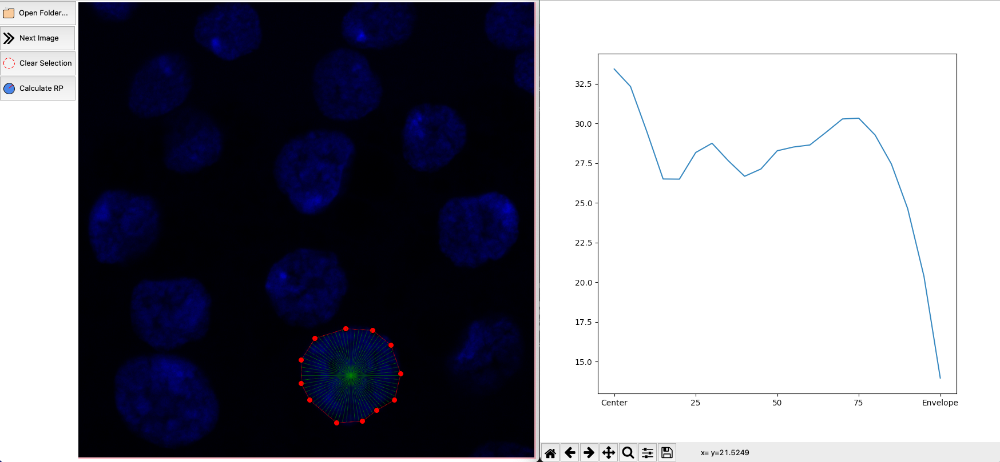

The app calculates the radial density profile of (almost) circular objects on an image. The creation of this project was inspired by this ImageJ plugin https://imagej.nih.gov/ij/plugins/radial-profile.html. However, whilst ImageJ plugin allows you to measure only perfectly-circullar shapes, this script is able to analyze flattened or distorded circullar objects, which is the case for biological objects like cell nuclei. 

